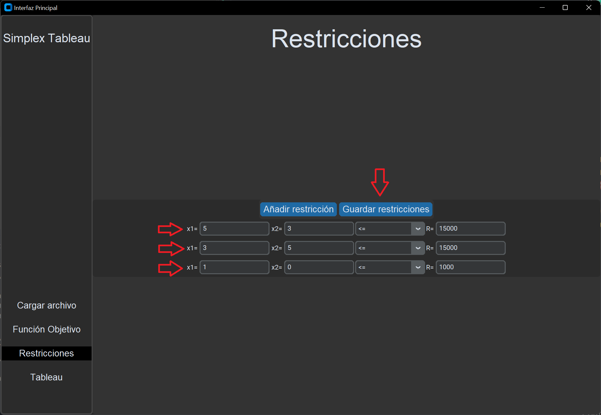

# Simplex tableau

Esta es mi aproximación al algoritmo simplex tableau, a continuación procederé con la guía de usario de la aplicación

> [!CAUTION]   
> Antes de la ejecución del programa es necesario instalar las dependencias en requirements.txt para ello haga uso de pip install -r requirements.txt

## Guía de usuario
Para la ejecución del programa desde nuestra consola de comandos escribiremos "py ./methods/interfaz.py"

Tras esto se nos mostrará una ventana que dividiremos en dos zonas:
- Barra lateral
- Zona principal

El programa trae precargado un problema por lo que yendo directamente a tableau podremos ver su formulación y resolución

### Barra Lateral

La barra lateral dispone de las distintas opciones que disponemos en nuestra interfaz.
Cada uno mostrará un contenido distinto en la zona principal.  
Por defecto comenzaremos con la página principal seleccionada.

> [!NOTE]  
> La opción marcada tiene un recuadro negro

### Zona principal
Esta zona nos mostrará el contenido de cada pestaña, esta cuanta con un título para identificar la pestaña en la que nos encontramos
#### Simplex Tableau

Esta es nuestra pagina principal donde contamos con una breve introducción a la aplicación y dos botones que nos llevarán a la pestaña de carga del archivo y a la pestaña de la función objetivo

#### Cargar Archivo
En esta pestaña podremos seleccionar un archivo de formato json que contará con un número de problemas a resolver.

#### Función objetivo
Esta pestaña cuenta con un campo para el número de variables que tras ser guardado generara un campo para introducir los coeficientes

#### Restricciones
Contamos con dos botones uno para añadir restricciones y otro para guardarlas.
> [!WARNING]  
> El botón de guardar solo debe pulsarse una vez introducidas todas las restricciones

#### Tableau
En esta pestaña se nos mostrará el tableau con los datos introducidos y un botón para resolverlo que tras concluir mostrará también el tableau resuelto.

### Normas archivo JSON
Todos los problemas a resolver estarán dentro de la clave problems y tendrán de atributos:
- `id`: Identificador del problema
- `objective`: Coeficientes de la función a optimizar
- `constraints`: Listado de restricciones donde el primer valor es el valor de la restricción y el resto el coeficiente de las variables
- `operators`: Indicador de si la restricción es >= : -1 <= : 1 = 0
- `minimize`: Booleano que indica si el problema es de minimización o de maximización

### Ejemplo de uso
#### Cargar Archivo JSON 

#### Manual

